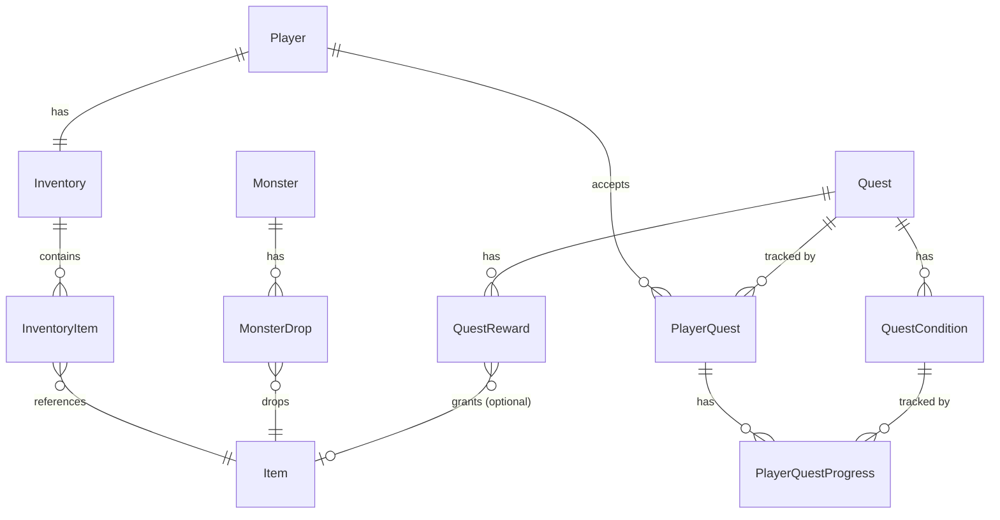

# ERD

## Aggregate 구조 (제안)

- **Quest**: `QuestCondition`, `QuestReward`를 소유 (cascade)
- **PlayerQuest**: `PlayerQuestProgress`를 소유 (cascade)
- **Inventory**: `InventoryItem`을 소유 (cascade) — 이미 적용됨

